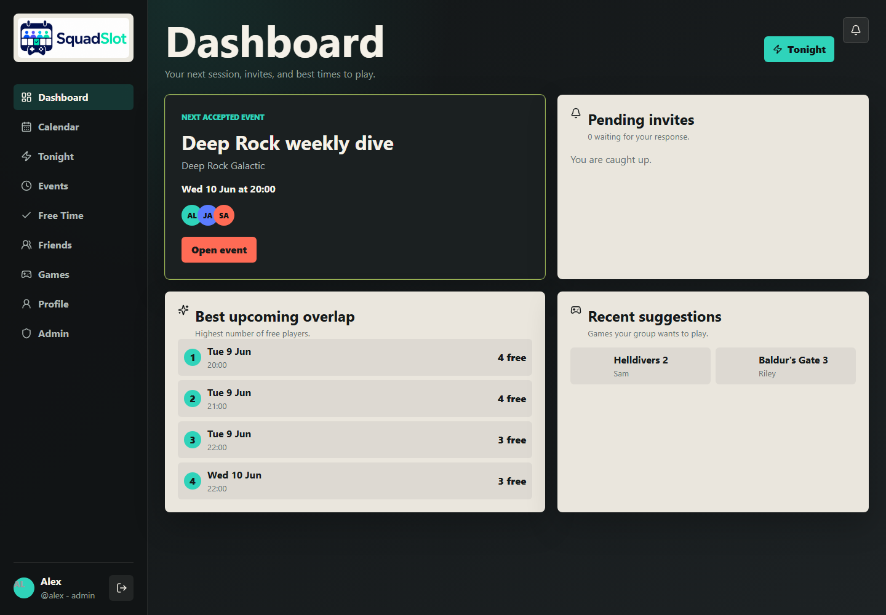
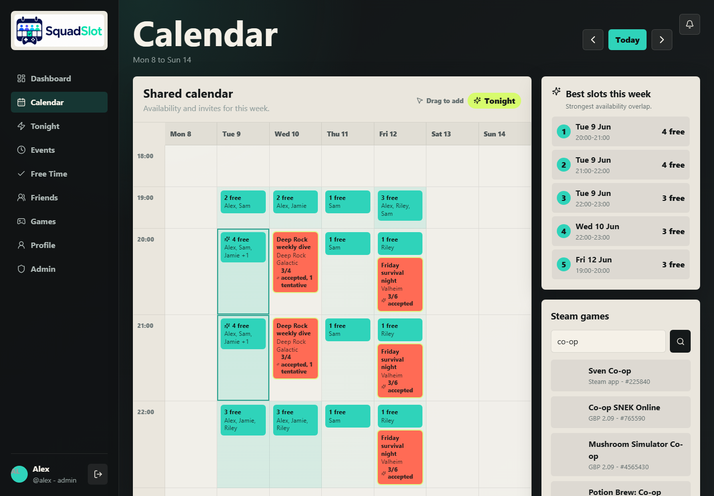

# SquadSlot

<p align="center">
  
</p>

SquadSlot is a self-hosted gaming calendar for friend groups. Share free time, find the best overlap, arrange sessions, vote on games, manage invitations, post Discord updates, and subscribe from a phone calendar.



## Highlights

- Pulse Board calendar with grouped availability, spanning events, Week/5-day modes, and responsive phone navigation
- One-off or recurring availability with multi-day drag selection
- Best-time finder that ranks the strongest player overlap
- Event invitations shown in Events until accepted, declined, removed, or completed
- Multiple squads with isolated members, calendars, events, and game suggestions
- Pre-event proposals with time and game voting plus random tie resolution
- Scheduling conflict warnings, capacity waitlists, and automatic promotion
- Event history for reviewing completed sessions
- Minimum and maximum player capacity with ready-state notifications
- Multiple game options, invitee voting, and random tie resolution
- Steam search-as-you-type with game artwork and details
- Event comments for servers, mods, DLC, and plan changes
- Private live calendar subscriptions for Apple Calendar, Google Calendar, and Outlook
- Discord updates, reminders, editable templates, test delivery, and bot RSVP buttons
- User profiles, colours, timezones, preferred hours, themes, and avatars
- Admin account management, audit history, temporary password resets, and encrypted scheduled backups
- Installable PWA for desktop and mobile home screens



## How It Works

1. The first registered account becomes the administrator.
2. Friends create their own normal accounts.
3. Everyone logs one-off or recurring free time.
4. SquadSlot highlights the strongest shared times.
5. A user creates an event, suggests games, and invites players.
6. Invitees respond, vote, comment, and optionally subscribe from their phone calendar.

No demo accounts or default passwords are created.

## Quick Start With Docker

Requirements:

- Docker Engine
- Docker Compose v2
- A writable Docker volume or host directory for SQLite

Clone the repository and create the deployment environment file:

```bash
git clone https://github.com/Nated4wgy/Squadslot.git
cd Squadslot
cp .env.example .env
nano .env
```

Set at least:

```env
SESSION_SECRET=replace-with-a-long-random-secret-at-least-32-characters
APP_URL=https://calendar.example.com
TZ=Europe/London
TRUST_PROXY=1
```

Generate a suitable secret with:

```bash
openssl rand -hex 32
```

Build and start SquadSlot:

```bash
docker compose up -d --build
```

Open the configured HTTPS address:

```text
https://calendar.example.com
```

The included Compose file stores SQLite data in the `squadslot-data` named volume, mounted inside the container at `/data`.

For a same-machine development test, set `APP_URL=http://localhost:8080`, set `TRUST_PROXY=0`, and open `http://localhost:8080`. Use HTTPS for access from other devices.

## Hosting From Copied Files

Git is not required on the server. Copy the complete project folder to the server, excluding local-only folders such as `node_modules`, `dist`, and `data`, then run:

```bash
cp .env.example .env
nano .env
docker compose up -d --build
```

Keep `docker-compose.yml`, `Dockerfile`, `package.json`, `package-lock.json`, `server`, `src`, and `public` together in the same project directory.

## Domain And HTTPS

Point your domain at the server and reverse proxy it to port `8080`. The public URL in `APP_URL` must exactly match the HTTPS address users open.

Example Caddy configuration:

```caddy
calendar.example.com {
    reverse_proxy 127.0.0.1:8080
}
```

Recommended environment:

```env
APP_URL=https://calendar.example.com
TRUST_PROXY=1
```

HTTPS is strongly recommended because SquadSlot uses secure session cookies in production, provides PWA installation, and generates public subscription URLs from `APP_URL`.

## First Login

Open SquadSlot and create the first account. It automatically receives the `admin` role. Later registrations are normal user accounts unless an administrator promotes them from the Admin page.

If a user forgets their password, an administrator can open **Admin > Accounts**, choose **Reset password**, and set a temporary password. Existing sessions and the old password are invalidated immediately. After signing in with the temporary password, the user must choose a new password before accessing the rest of SquadSlot.

## Availability And Scheduling

Availability can be added in several ways:

- Drag over one calendar day to prefill a one-off time range.
- Drag across several days to preselect a recurring weekly schedule.
- Use quick presets such as Tonight, Tomorrow evening, Weeknights, Friday night, Saturday night, or Weekend evening.
- Create personal saved presets.
- Build recurring rules from the Availability page and skip individual dates as exceptions.

When several users are free, the calendar groups them into one entry and shows the names in its detail popover. Accepted or tentative events suppress overlapping free-time display for committed players.

## Live Calendar Subscriptions

Each account can generate a private feed from **Profile > Live calendar subscription**. The stable `.ics` URL includes:

- Accepted and tentative events
- The account owner's free-time entries
- Other users' names only for the exact periods when they overlap the account owner's free time

Accepted or tentative event time is removed from availability before the feed is generated. Other users' unrelated availability is never included.

- Apple Calendar: use **Subscribe** or add the `webcal://` URL.
- Google Calendar: choose **Other calendars > From URL** and paste the HTTPS URL.
- Outlook: choose **Add calendar > Subscribe from web** and paste the HTTPS URL.

SquadSlot requests a 15-minute refresh, but each provider controls its actual polling schedule. Google Calendar may take substantially longer to show changes.

The subscription URL is a bearer credential. Anyone with the URL can read that user's events, free time, and matching availability. Regenerate or revoke the link immediately if it is exposed.

## Discord Integration

SquadSlot supports simple one-way webhooks and an optional Discord application for RSVP buttons. A gateway process is not required.

Create a webhook from the target Discord channel under **Edit Channel > Integrations**, then configure it from the Admin page or `.env`:

```env
DISCORD_WEBHOOK_URL=https://discord.com/api/webhooks/your-webhook-url
DISCORD_BOT_NAME=SquadSlot
```

Available notifications include:

- Availability added or removed
- Game suggested
- Session invite created or removed
- Invite response changed
- Minimum player count reached
- Event tomorrow
- Event starting in one hour
- RSVP deadline
- Weekly availability summary

Administrators can enable or disable each notification, edit title and message templates, set reminder timing, and send a test webhook.

For Accept, Tentative, and Decline buttons, create a Discord application and bot, add it to the server with permission to view the target channel and send messages, then enter the application ID, public key, bot token, and channel ID under **Admin > Discord**. Set the application's Interactions Endpoint URL to the URL shown there, for example:

```text
https://calendar.example.com/discord/interactions
```

Each player must also enter their numeric Discord user ID in **Profile**. Incoming interactions are verified with Discord's Ed25519 signature before an RSVP is changed.

## Administration And Backups

Administrators can:

- Promote or demote accounts
- Delete accounts
- Set temporary passwords for locked-out users
- Configure and test Discord
- Manage notification templates and reminder settings
- Export and restore a complete JSON backup
- Run encrypted on-disk backups and review administrative audit records

Backups include:

- Users and bcrypt password hashes
- Availability, recurring rules, exceptions, and presets
- Events, invitations, capacity, votes, and comments
- Profiles and appearance settings
- Live calendar subscription token hashes
- Discord settings, notification rules, and reminder history

Backups also include squads, proposals, UTC event timestamps, Discord identities, and audit records. They do not contain plaintext account passwords, but they can contain a Discord webhook URL and authentication hashes, so store them privately.

To enable encrypted automatic backups in `/data/backups`, set:

```env
AUTO_BACKUP_ENABLED=true
BACKUP_ENCRYPTION_KEY=replace-with-a-long-separate-backup-secret
BACKUP_INTERVAL_HOURS=24
BACKUP_RETENTION=14
```

Keep `BACKUP_ENCRYPTION_KEY` outside the backup volume. The same key is required to restore encrypted files.

## Updating

Create an Admin backup before upgrading, then update and rebuild:

```bash
git pull
docker compose up -d --build
```

For a manually copied deployment, replace the application files while preserving `.env` and the Docker volume, then run:

```bash
docker compose up -d --build
```

Database migrations are additive and run automatically when the new container starts. The `squadslot-data` volume persists across rebuilds.

See [CHANGELOG.md](CHANGELOG.md) for release details.

## Troubleshooting

Check container status and recent logs:

```bash
docker compose ps
docker compose logs --tail=150 squadslot
```

Common causes of restart loops:

- `SESSION_SECRET` is missing or shorter than 32 characters.
- A bind-mounted `/data` directory is not writable by the container user.
- Another service already uses port `8080`.
- `APP_URL` does not match the public domain or proxy scheme.

If old UI assets remain after an update, perform a hard refresh or remove and reinstall the PWA so the updated service worker takes control.

## Local Development

Requirements:

- Node.js 20
- npm

Install and run:

```bash
npm ci
npm run dev
```

Frontend:

```text
http://localhost:5173
```

API:

```text
http://localhost:8080
```

Verification:

```bash
npm run lint
npm test
npm run build
```

Run the production server without Docker:

```bash
SESSION_SECRET=replace-with-a-long-random-secret-at-least-32-characters npm start
```

## Environment Variables

| Variable | Default | Purpose |
| --- | --- | --- |
| `PORT` | `8080` | Express server port |
| `DATABASE_PATH` | `/data/squadslot.db` in Docker | SQLite database location |
| `TZ` | `Europe/London` | Container timezone |
| `SESSION_SECRET` | none in production | Signs login sessions; minimum 32 characters |
| `APP_URL` | `http://localhost:8080` | Public base URL used for links and calendar feeds |
| `TRUST_PROXY` | `0` | Set to `1` behind a trusted reverse proxy |
| `DISCORD_WEBHOOK_URL` | empty | Optional Discord webhook |
| `DISCORD_BOT_NAME` | `SquadSlot` | Discord webhook display name |
| `DISCORD_APPLICATION_ID` | empty | Discord application ID for interactive RSVP buttons |
| `DISCORD_PUBLIC_KEY` | empty | Discord application Ed25519 public key |
| `DISCORD_BOT_TOKEN` | empty | Bot token used to post interactive messages |
| `DISCORD_CHANNEL_ID` | empty | Channel receiving interactive bot messages |
| `AUTO_BACKUP_ENABLED` | `false` | Run encrypted backups on a schedule |
| `BACKUP_ENCRYPTION_KEY` | empty | Secret used for AES-256-GCM backup encryption; minimum 16 characters |
| `BACKUP_INTERVAL_HOURS` | `24` | Hours between automatic backups |
| `BACKUP_RETENTION` | `14` | Number of encrypted backups retained |
| `SQUADSLOT_CLEAN_DEMO_DATA` | `false` | Development-only cleanup for legacy seeded demo users |

## Security

- Passwords are stored as bcrypt hashes.
- Login sessions use signed HTTP-only, same-site cookies.
- Production requires a strong `SESSION_SECRET`.
- State-changing API requests enforce JSON content type and same-origin checks.
- Authentication endpoints have in-memory rate limiting.
- Discord webhook URLs are restricted to Discord webhook hosts.
- Discord interactions require a valid Ed25519 request signature.
- Squad-scoped records are checked against the active membership on every API operation.
- Subscription tokens are random bearer credentials stored as SHA-256 hashes.
- Common CSP, frame, referrer, permissions, and content-sniffing headers are enabled.
- The Docker runtime runs as the unprivileged `node` user.

## Technology

- React and Vite
- Node.js and Express
- SQLite through `better-sqlite3`
- Docker multi-stage build
- Steam Store public endpoints
- Discord webhooks
- iCalendar (`.ics`) feeds
- Progressive Web App manifest and service worker

## Steam Availability

Steam search uses public Steam Store endpoints from the server. If Steam is temporarily unavailable or rate-limited, SquadSlot remains usable and game search results may be empty until Steam responds again.
